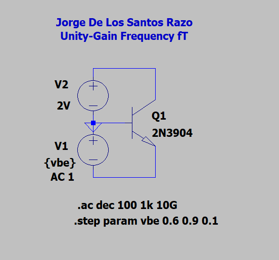
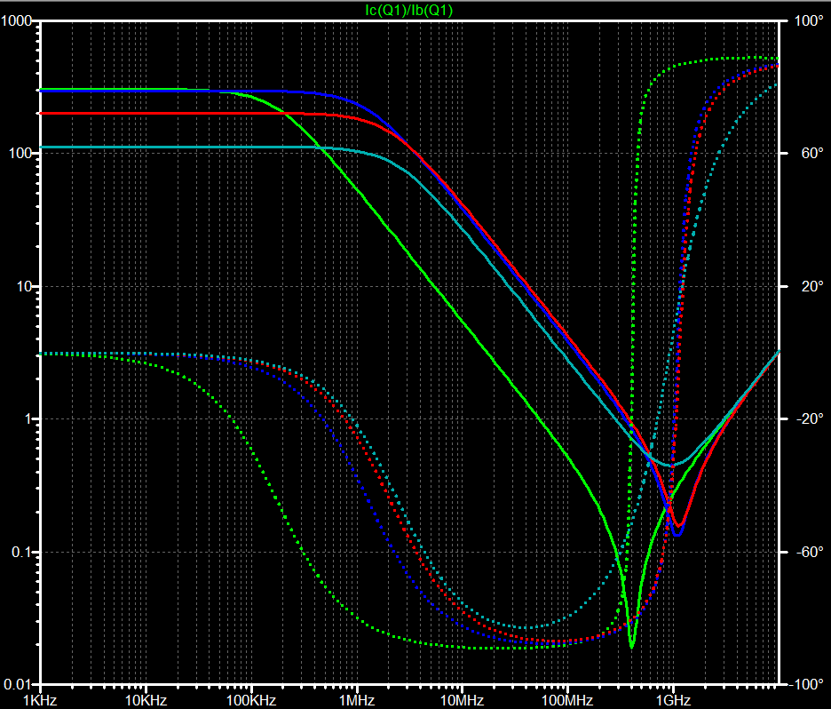
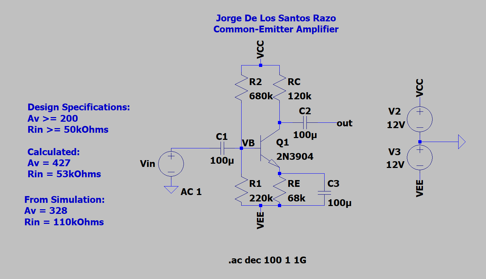
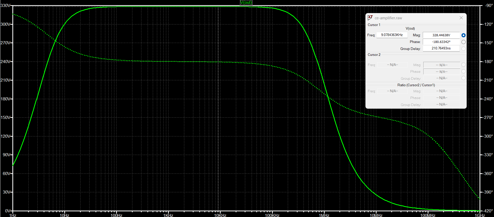
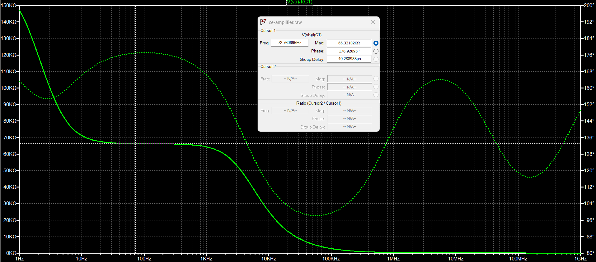

# CE Amplifier
The Common-Emitter Amplifier is very popular in electronics, thus understanding how they are designed is fundamental for those interested in electronics, and especially important for those interested in Anlog Design. In this repo, I found important parameters of the 2N3904 BJT--parameters such as the early voltage, input & output resistance, and its $\beta$. From the parameters found a CE Amplifier was then designed.

## Early Voltage
The early voltage is obtained by extrapolating a best-fit line onto our characteristic curves and looking at where they intersect the x-axis. Unfortunately LTSpice doesn't have a way to create best-fit lines to extrapolate so two different methods were used

* **Method 1**:
  1) Zoom into one of the characteristic curves. Make sure to zoom in on the forward-active region of the curve
  2) put your cursor at two points of the curve (make sure the two points are somewhat close to each other) and record the (x,y) point.
  3) Use algebra to calculate the `y = mx + b` parameters and solve for `y = 0`. The result will be our approximate early voltage.
* **Method 2**
  1) Change the VCE DC sweep range from 0 - 12 to -100 - 12
  2) plot the VCE voltage along with the characteristic curves. At negative voltages the characteristic curves will have essentially a current of zero.
  3) Where the VCE curve intersects the characteristic curves will be our approximate early voltage.

 Using **Method 1** we get $$V_{A1} = 96V$$ and using **Method 2** we get $$V_{A2} = 90V$$. 

 ## Current Gain $\beta$ 
The relationship between $$I_C$$ and $$I_B$$ is approximately $$I_C = \beta I_B$$, where $$\beta$$ is the current gain of the transistor. The current gain $$\beta$$    can be obtained by plotting the ratio $$I_C/I_B$$.

| Current Gain Circuit                                     | Current Gain Plot                                     |
|----------------------------------------------------------|-------------------------------------------------------|
|  |  |

Using this method we get the maximum current gain is approximately $$\beta = 293.5$$ and the collector current for this beta vlaue is approximately $$I_C = 8.9\text{mA}$$

## Unity Gain Frequency $$f_T$$
The unity gian frequency is useful when evaluating the frequency response of the CE amplifier. This parameter won't be used in this project however it is still an important parameter to obtain. 

By sweeping $$V_{BE}$$ we an performing an AC sweep we can obtain the unity-gain frequency at different values of $$V_{BE}$$.

| Current Gain Circuit                                     | Current Gain Plot                                                                     |
|----------------------------------------------------------|---------------------------------------------------------------------------------------|
|  |  |

  
| $$V_{BE}$$  |  $$f_T$$  |
|-------------|-----------|
|    0.6V     |  53.7MHz  |
|    0.7V     |  346.7MHz |
|    0.8V     | 380.2MHz  |
|    0.9V     |  281.8MHz |

## Common-Emitter Amplifier Design
A CE amplifier was designed using the $$V_A$$ and $$\beta$$ found above. The CE amplifier was designed to have the following values:
  * $$|A_V| \geq 200$$
  * $$R_{in} \geq 50k\Omega$$
  * $$R_I = 0$$
  * $$R_3 = \infty$$

The collector current was chosen to be:

$$I_C = 0.1~\text{mA}$$ 

A good rule-of-thumb is to set $V_C$ to be the midpoint of the power supplies for maximum voltage swing---since we are using a double power supply with $$\pm 12~\text{V}$$, their midpoint is $0~\text{V}$:

$$V_C = 0~\text{V}$$

With the chosen collector current $I_C$ and the collector voltage $V_C$, we can calculate the value of the collector resistor $R_C$:

$$I_C = \frac{V_{CC} - V_C}{R_C} \Rightarrow R_C = \frac{V_{CC} - V_C}{I_C} = \frac{12~\text{V}}{0.1~\text{mA}} = 120~\text{k}\Omega$$

Since $120~\text{k}\Omega$ is a standard resistor value, we can keep it.

### Small-Signal Parameters  
  * $g_m = \frac{I_C}{V_T} = \frac{0.1~\text{mA}}{25~\text{mV}} = 4~\text{mS}$
  * $r_{\pi} = \frac{\beta}{I_C} = \frac{312}{0.1~\text{mA}} = 78~\text{k}\Omega$
  * $r_o = \frac{V_A}{I_C} = \frac{96~\text{V}}{0.1~\text{mA}} = 960~\text{k}\Omega$

Note that $r_{\pi} = 78~\text{k}\Omega$, which is large enough to meet our $R_{in}$ requirement--- $R_E$ can be completely bypassed. 

### Gain 
The gain for a common-emitter amplifier with a bypassed $R_E$ is the following:

$$A_v = -\frac{R_B \parallel r_{\pi}}{R_I + R_B \parallel r_{\pi}} g_m R_L$$

Since for our design $R_I = 0$, the gain formula simplifies to 

$$A_v = -g_m R_L$$

Where $R_L = r_o \parallel R_C \parallel R_3 = (960~\text{k}\Omega) \parallel (120~\text{k}\Omega) \parallel (0 \Omega) = 106.7~\text{k}\Omega$. So our gain is the following:

$$|A_v| = (4~\text{mS})(106.7~\text{k}\Omega) = 426.8$$

### Finding $R_E$
Since we chose $V_C = 0~\text{V}$, the voltage from the $V_C$ node to the $V_{EE}$ node:

$$V_{CE} + I_E R_E = 12~\text{V}$$

Since the euqation above has two unknowns, let's choose $V_{CE} = 6~\text{V}$, which when we solve for $R_E$ we get the following:

$$R_E = \frac{12~\text{V} -V_{CE}}{I_E}$$

Note that $I_E = I_C + I_B = I_C + \frac{I_C}{\beta}$. When plugging into the above equation we get

$$R_E = \frac{12~\text{V} -V_{CE}}{I_C + \frac{I_C}{\beta}} \approx 60~\text{k}\Omega$$

Since $60~\text{k}\Omega$ is not a standard resistor value, we choose 

$$R_E = 68~\text{k}\Omega$$

### Finding $R_1$ and $R_2$
Fimding these resistor values is a little tricky becuase we need two equations (since we have two unknowns).  
So far we have not chekced if we meet the $R_{in}$ restriction.

$$R_{in} = R_{iB} \parallel R_B \geq 55~\text{k}\Omega$$

Note that above we specified $\geq 55~\text{k}\Omega$ instead of the $\geq 50~\text{k}\Omega$. This is because I am adding a $10\%$ tolerance to our design specs for better results. 
Solving for $R_B$ above we get

$$R_B \approx 190~\text{k}\Omega$$

Which means that 

$$
\frac{R_1 R_2}{R_1 + R_2} = 190 \ \text{k}\Omega \hspace{0.5cm} (1)
$$

Now let's find $V_{eq}$ since it will be useful when solving for our resistor values. Writing the KVL equation around the $V_{eq}$ loop we get:

$$
\begin{align*}
V_{eq} &= I_B R_B + I_E R_E - V_{EE}\\
       &= \frac{I_C}{\beta} R_B + (I_C + \frac{I_C}{\beta}) R_E - V_{EE}\\
       &= \left(\frac{0.1~\text{mA}}{\beta}\right) (190~\text{k}\Omega) + \left( 0.1~\text{mA} + \frac{0.1~\text{mA}}{\beta} \right) (60~\text{k}\Omega) - 12~\text{V}\\
       &= -5.92~\text{V}
\end{align*}
$$

Note that

$$V_{eq} = (V_{CC} + V_{EE}) \frac{R_1}{R_1 + R_2} - V_{EE}$$

Solving for $\frac{R_1}{R_1 + R_2} yields the following

$$
\begin{align*}
\frac{R_1}{R_1 + R_2} &= \frac{V_{eq} + V_{EE}}{V_{CC} + V_{EE}}\\
                      &= \frac{-5.92~\text{V} + 12~\text{V}}{24~\text{V}}\\
                      &\approx 0.253\\
\end{align*}
$$

Plugging this into Equation (1) results in the following resistor values:

$$R_1 \approx 254~\text{k}\Omega \text{  and  } R_2 \approx 751~\text{k}\Omega$$

After choosing standard resistor values we get the following resistor values:

$$
\begin{flalign}
    & R_1 = 220~\text{k}\Omega\\
    & R_2 = 680~\text{k}\Omega\\
\end{flalign}
$$

The resistor values for our CE amplifier are then:

$$
\begin{flalign}
    & R_C =  120~\text{k}\Omega\\
    & R_E =  68~\text{k}\Omega\\
    & R_1 = 220~\text{k}\Omega\\
    & R_2 = 680~\text{k}\Omega\\
\end{flalign}
$$

## LTspice Simulation of Designed CE Amplfiier

| Common-Emitter Gain Plot                                                 | Input Resistance Plot                                                  |
|--------------------------------------------------------------------------|------------------------------------------------------------------------|
|                          |                 |

### Calculated vs Simulated

|   -  | $I_C$| $R_1$ | $R_2$ | $R_E$ | $R_C$ | $\|A_v\|$ | $R_{in}$ |  
| :--- | :---: |:---: | :---: | :---: | :---: | :---: | :---: |
| **Design Specs** | N/A | N/A | N/A | N/A | N/A | 200 | $50\ \text{k}\Omega$ | 
| **Calculated** | $0.1~\text{mA}$ | $220\ \text{k}\Omega$ | $680\ \text{k}\Omega$ | $68\ \text{k}\Omega$ | $120\ \text{k}\Omega$ | 427 | $53\ \text{k}\Omega$ |
| **Simulated** | $76.8~\mu\text{A}$ | $220\ \text{k}\Omega$ | $680\ \text{k}\Omega$ | $68\ \text{k}\Omega$ | $120\ \text{k}\Omega$ | 328 | $66\ \text{k}\Omega$ |

## Circuit of Designed CE Amplfiier

The designed CE amplifier was then built and the following parameters were measured:

$$
\begin{flalign}
    & Av = \frac{1.95~\text{V}}{12.9~\text{mV}} = 151.2\\
    & R_{in} = \left( \frac{1.1}{12.9 - 1.1} \right) (51~\text{k}\Omega) = 4.8~\text{k}\Omega\\
\end{flalign}
$$

Where the input resistance was obtained by placing a resistor in series with the input capacitor C1, measuring the voltage at the base terminal after placing resistor, and using the voltage divider formula to solve for $R_{in}$

$$
\begin{align*}
  V_B &= V_{source} \times \left( \frac{R_{in}}{R_{test} + R_{in}} \right)\\
      R_{in} &= R_{test} \times \left( \frac{V_B}{V_{source} - V_{B}} \right)
\end{align*}
$$

As can be seen, our parameters are not met. I played around with the resistor values and the gain was improved by replacing $R_C = 120~\text{k}\Omega$ with $R_C = 68~\text{k}\Omega$ and obtained a better gain of 

$$A_v = \frac{3.78~\text{V}}{14.2~\text{mV}} = 266.2$$
