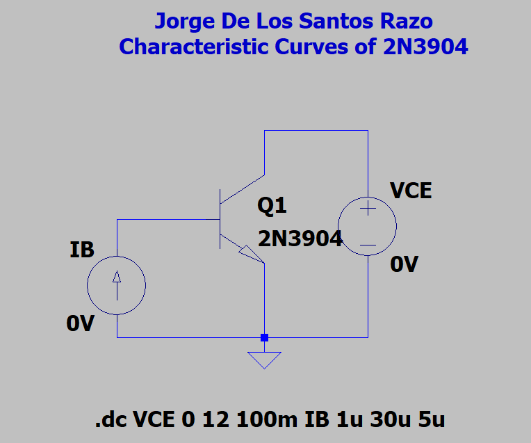
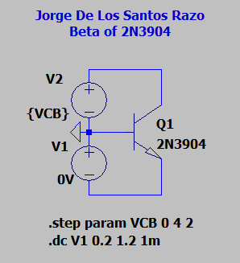
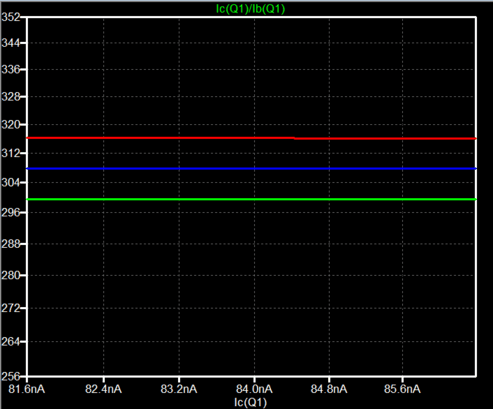

# CE Amplifier
The Common-Emitter Amplifier is very popular in electronics, thus understanding how they are designed is fundamental for those interested in electronics, and especially important for those interested in Anlog Design. In this repo, I found important parameters of the 2N3904 BJT--parameters such as the early voltage, input & output resistance, and its $\beta$. From the parameters found a CE Amplifier was then designed.

## Early Voltage
The early voltage is obtained by extrapolating a best-fit line onto our characteristic curves and looking at where they intersect the x-axis. Unfortunately LTSpice doesn't have a way to create best-fit lines to extrapolate so two different methods were used

* **Method 1**:
  1) Zoom into one of the characteristic curves. Make sure to zoom in on the forward-active region of the curve
  2) put your cursor at two points of the curve (make sure the two points are somewhat close to each other) and record the (x,y) point.
  3) Use algebra to calculate the `y = mx + b` parameters and solve for `y = 0`. The result will be our approximate early voltage.
* **Method 2**
  1) Change the VCE DC sweep range from 0 - 12 to -100 - 12
  2) plot the VCE voltage along with the characteristic curves. At negative voltages the characteristic curves will have essentially a current of zero.
  3) Where the VCE curve intersects the characteristic curves will be our approximate early voltage.

 Using **Method 1** we get $$V_{A1} = 96V$$ and using **Method 2** we get $$V_{A2} = 90V$$. 

 ## Current Gain $\beta$ 
The relationship between $$I_C$$ and $$I_B$$ is approximately $$I_C = \beta I_B$$, where $$\beta$$ is the current gain of the transistor. The current gain $$\beta$$    can be obtained by plotting the ratio $$I_C/I_B$$.

| Current Gain Circuit                                     | Current Gain Plot                                     |
|----------------------------------------------------------|-------------------------------------------------------|
|  |  |

Using this method we get the maximum current gain is approximately $$\beta = 300$$.

## Common-Emitter Amplifier Design
A CE amplifier was designed using the $$V_A$$ and $$\beta$$ found above. The CE amplifier was designed to have the following values:
  * $$|A_V| \geq 200$$
  * $$R_{in} \geq 50k\Omega$$
  * $$R_I = 0$$
  * $$R_3 = \infty$$

